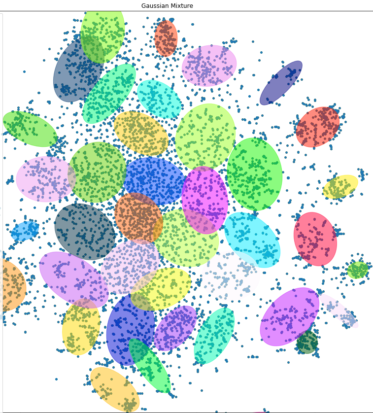
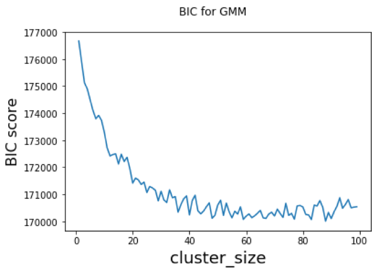
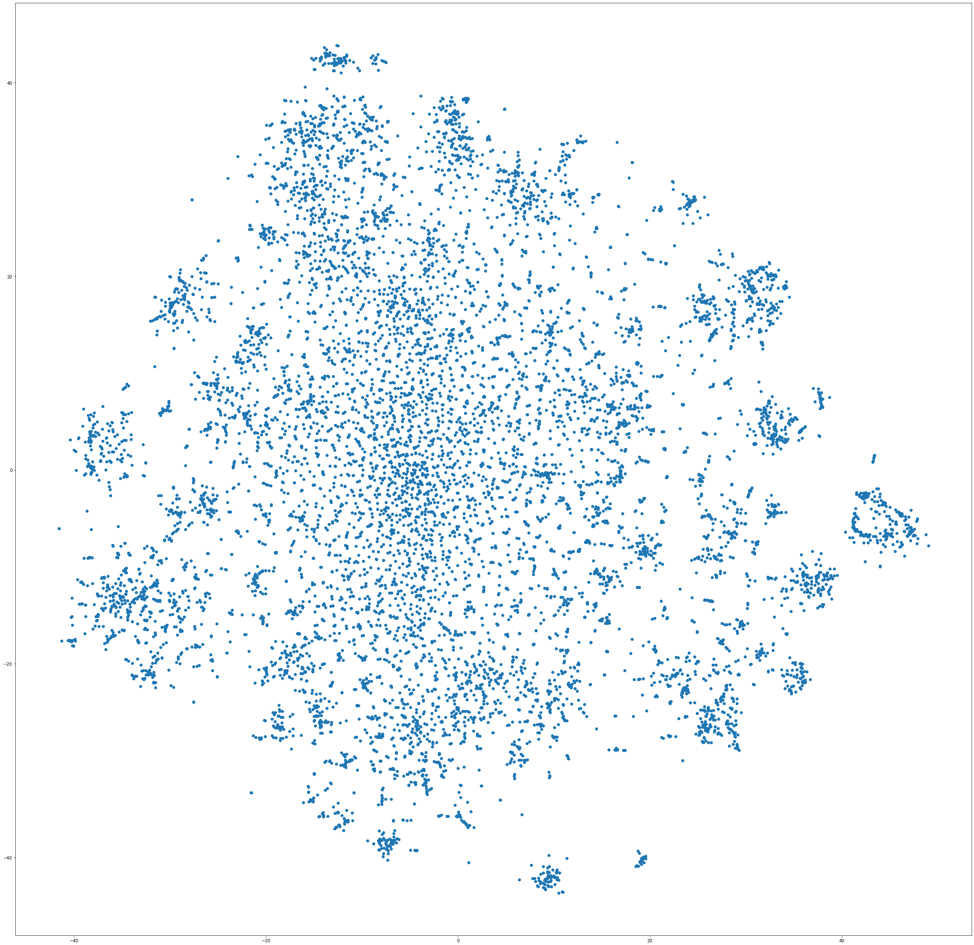
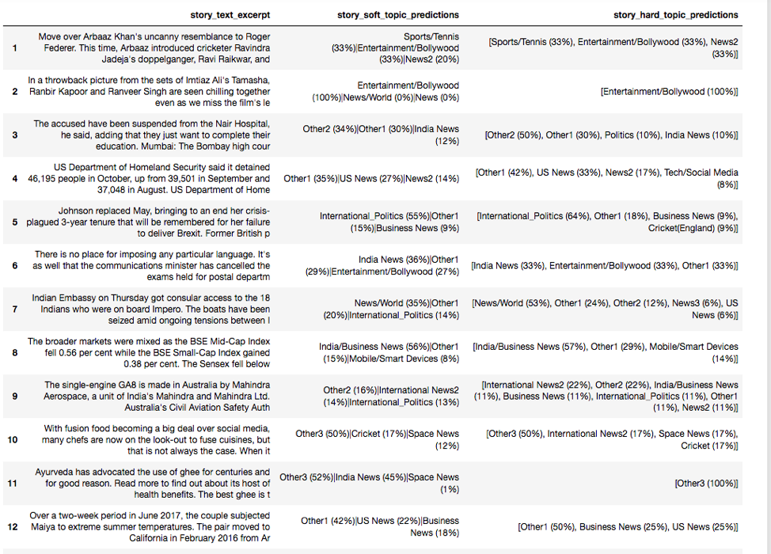

# GMMSpark
Implementation of Multivariate Gaussian (regular python) and Gaussian Mixture Model in pyspark

For this project, we use Machine Learning (specifically - Clustering using Unsupervised Learning) in order to map web stories to a topic.

A popular clustering algorithm is Gaussian Misxture Model. W e use it to identify a words(data points) to cluster(topic) mapping. Once we have that, we can tag a story with multiple topics depending on the content of the article.

We chose Gaussian Mixture Model for the following reasons:
  * The gaussian kernels is not restricted to a spherical shape (unlike in, for example - KMeans). Thus our clusters could fit the data better (a flexible ellipse) than if we chose other clustering methods like Kmeans.
  * There could be many words that could be counted as components of multiple topics. Thus a hard clustering method would not be the optimum choice for our use case.
  
#### Identified Clusters

### Dataset and Preprocessing

#### Dataset

We use a curated dataset of about 50,000 articles scraped from various news websites and try to cluster the data into topics that the stories can be tagged with. Only stories' text content is used for clustering as our goal is to identify themes for them.

#### Parameters

One of the main hyperparameters for this model is choosing the number of clusters. For GMM, a good guide to choose the number of clusters is to look at a value called BIC (Bayesian Information Criterion) score. It penalizes the number of parameters for the model and thus reduces overfitting which increases the model’s generalizability.

We choose cluster size ranging from 2 to 100 and plot the BIC score for each of them. 

Based on the BIC curve, we chose value 41 as the number of clusters.

Another decision parameter is the covariance matrix type for each gaussian. It can be chosen to be full, diagonal, tied (shared between all clusters). We chose it to be full as we wanted the gaussians to be as flexible as possible with respect to the data. 

### Plotting words

Words are converted to word-embeddings using the Word2Vec algorithm with a dimensionality of 100. However, such high-dimensional data can not be plotted in 2-d space. We use T-SNE to project the data onto a 2d plane andthen plot the word positions. 

#### Implemementation
Apache Spark is the goto framework for many types of distributed workloads. It is not limited to general-purpose data processing. If a workload can be processed parallelly in batches (or even streams), we can use Spark's API to transform that algorithm for distributed processing. Lately, Spark is becoming increasing popular for many Machine Learning computation tasks.

Spark provides implementation of several popular Machine Learning Algorithms via its MLLib API. However, We tried to implement the algorithm using the RDD API from scratch in python. It accepts data in txt format which is easy to create.

There seems to be a bug in the implementation. As the algorithm is highly sensitive to initialisation of clusters, we tried random initialisation but that made all clusters converge to one giant cluster. However, if clusters are initialised in a bootsrapped fashion - using results from a K-Means on a portion of the data, it performs well.
I have not been able to figure the bug out. I will appreciate any help.

#### Sample predictions
Here are some example prediction results from a GMM trained on the same dataset using Scikit-learn

